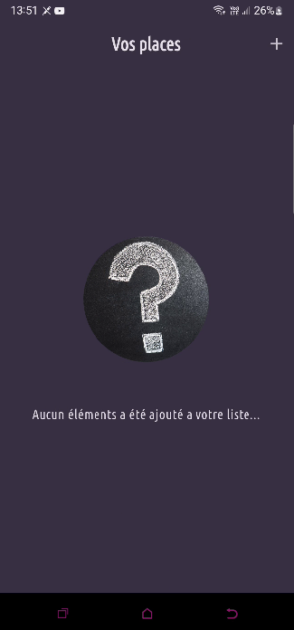
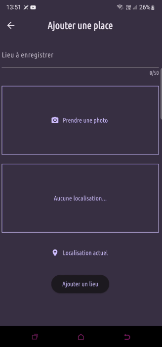
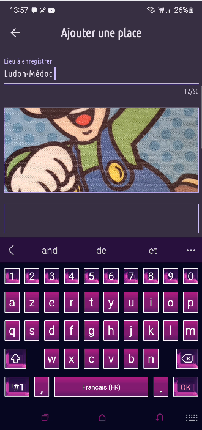
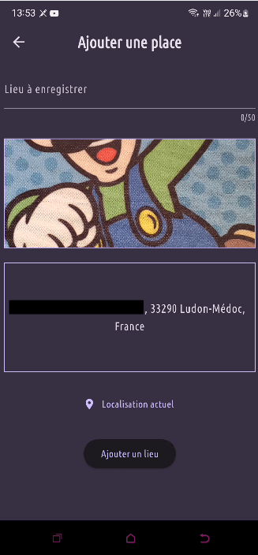
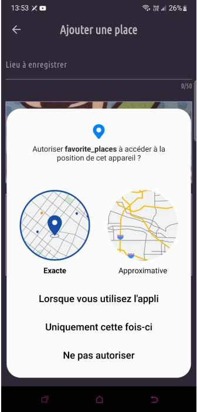
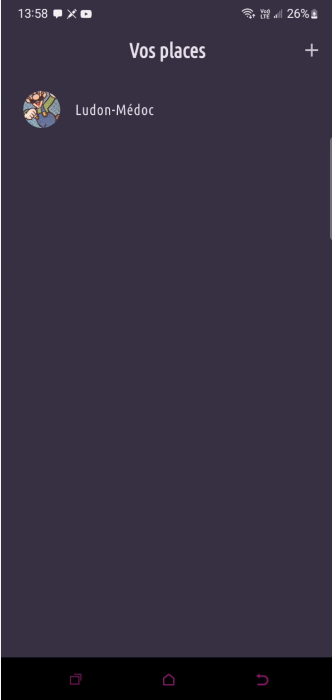
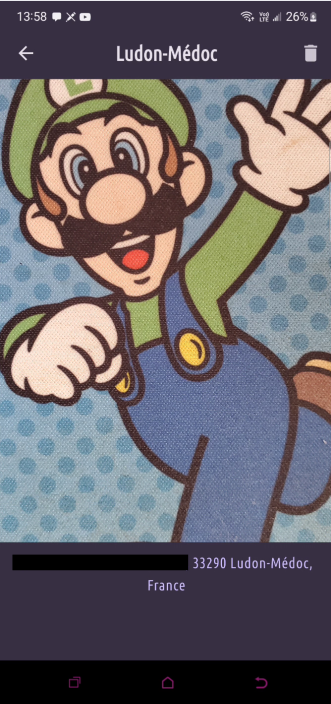

# 📚 Flutter Favorite Place

**Flutter Favorite Place** est une application mobile développée avec **Flutter** permettant d’ajouter, enregistrer et visualiser des lieux favoris.  
L’objectif principal du projet est d’apprendre la prise de photo, la sélection d’images, la géolocalisation, l’utilisation de widgets avancés et la gestion d’état.

---

## 🎯 Objectifs du projet

- Apprendre à utiliser la caméra ou la galerie avec Flutter
- Gérer la sélection d’images locales
- Comprendre la gestion d’état avec `setState`
- Enregistrer et afficher des lieux favoris
- Manipuler les widgets Flutter avancés (ListView, Cards, etc.)
- Structurer un projet Flutter propre et cohérent

---

## 🧩 Fonctionnalités

- Ajouter un lieu favori
- Prendre une photo ou sélectionner une image
- Donner un nom au lieu
- Afficher la liste des lieux enregistrés
- Visualiser les images enregistrées
- Interface moderne et simple
- Code propre et adapté à l’apprentissage

---

## 🛠️ Technologies utilisées

- **Flutter**
- **Dart**
- Widgets **Material**
- Gestion d’état simple via `setState`
- Sélection d’image (camera / gallery)
- Stockage local (selon implémentation : File, path_provider)

---
### Accueil


### Ajouter un lieu


### Ajouter une localisation


### Ajouter une photo


### Rendu de l'image


### Ajouter une localisation


### Ajouter une localisation


### Page d'information du lieu



---

## 🧱 Architecture simple du projet

```text
lib/
 ├─ main.dart                  # Point d'entrée de l'application
 ├─ models/
 │    └─ place.dart            # Modèle de données d'un lieu
 ├─ widgets/
 │    ├─ image_input.dart      # Widget pour prendre ou choisir une image
 │    ├─ location_input.dart   # (si utilisé) Widget pour la localisation
 │    └─ places_list.dart      # Liste des lieux
 └─ screens/
      ├─ places_screen.dart    # Écran principal affichant les lieux
      └─ add_place_screen.dart # Écran d’ajout d’un lieu

